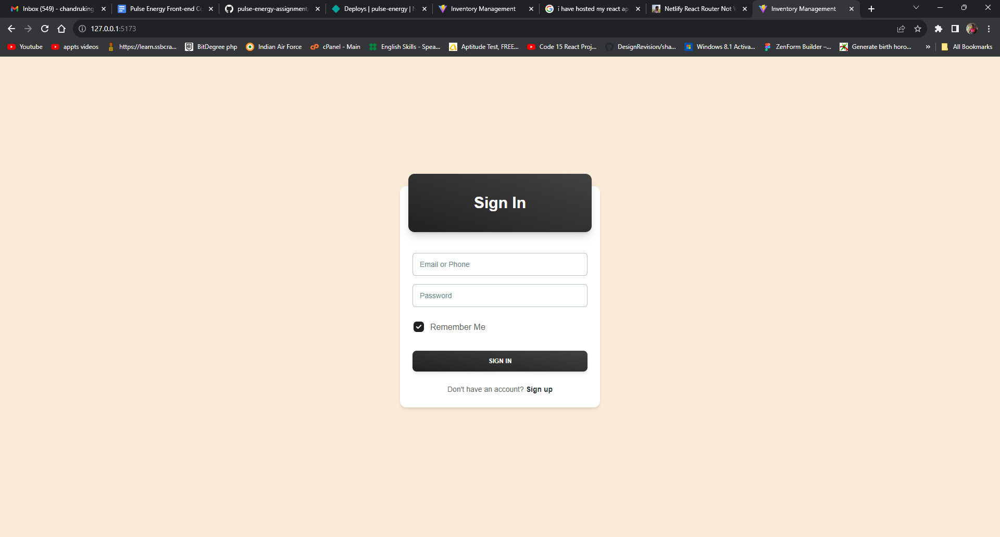
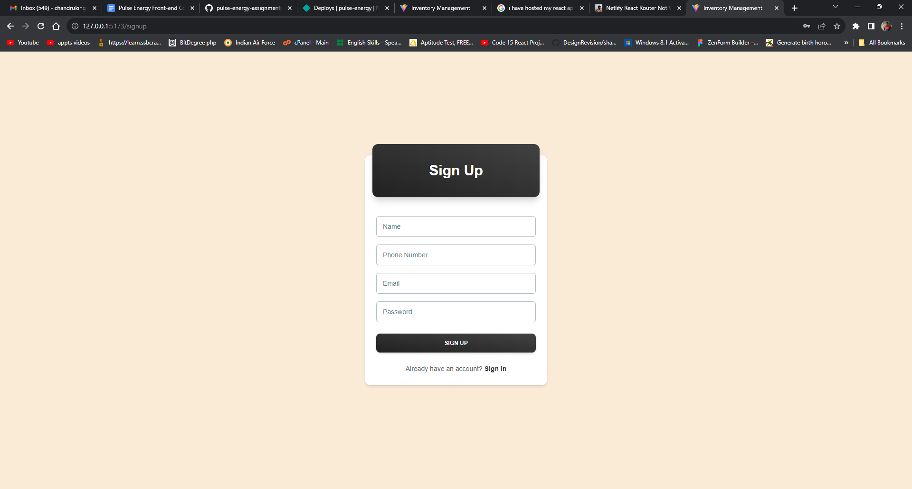
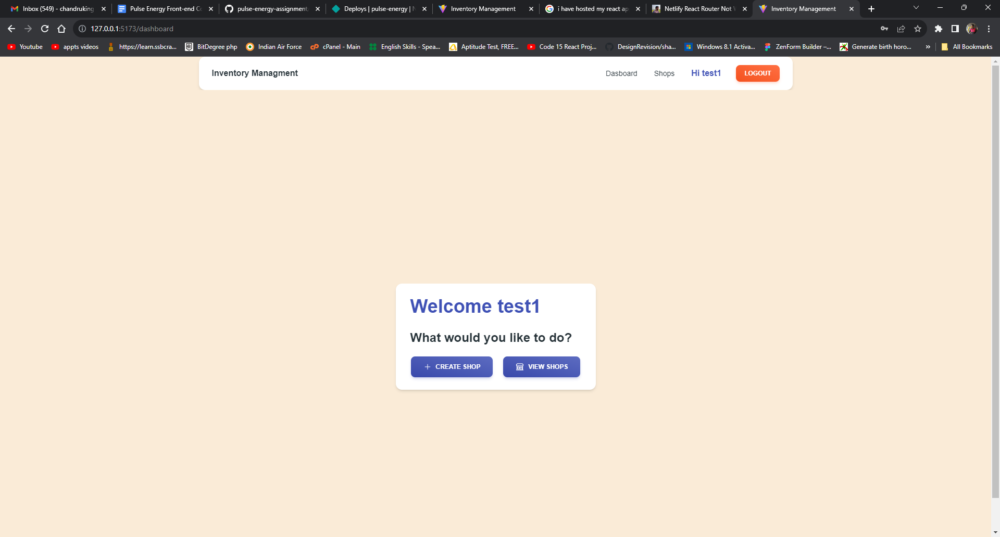
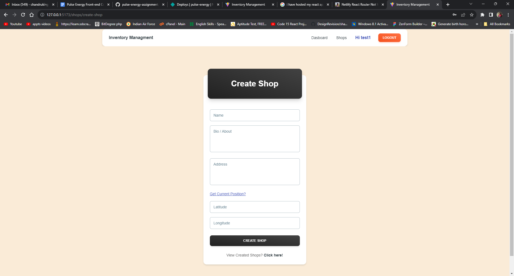
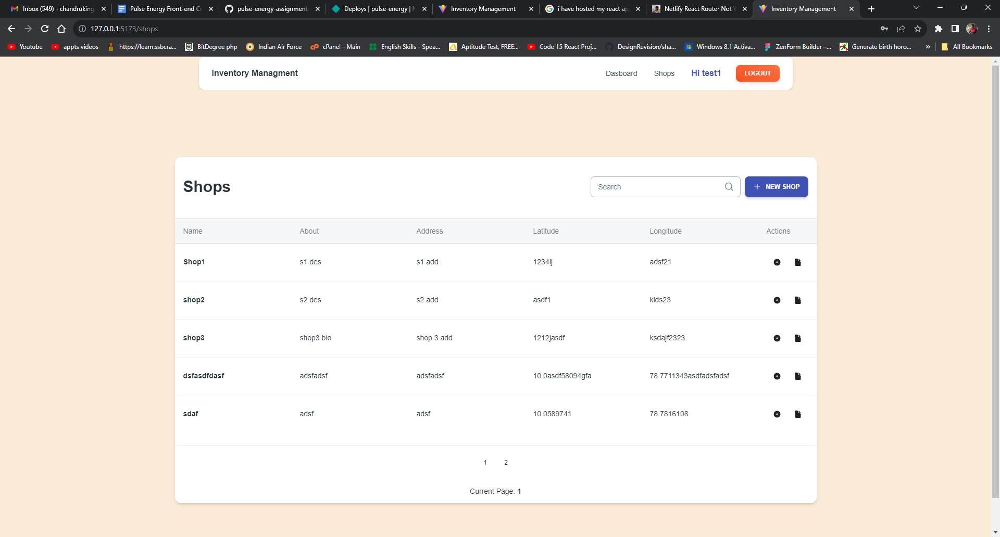
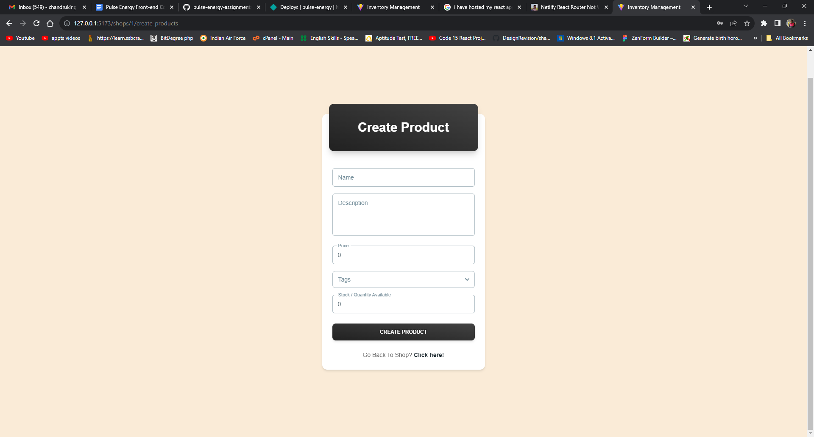
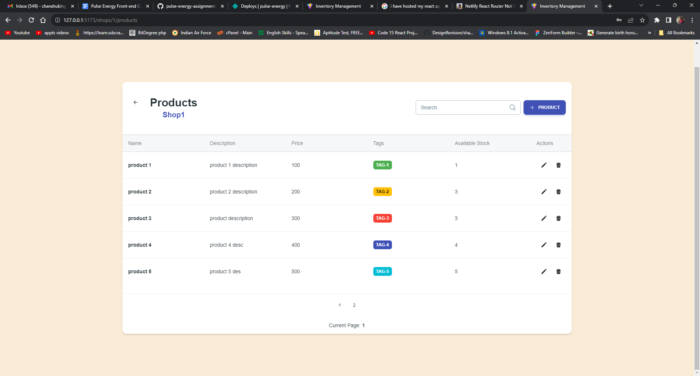
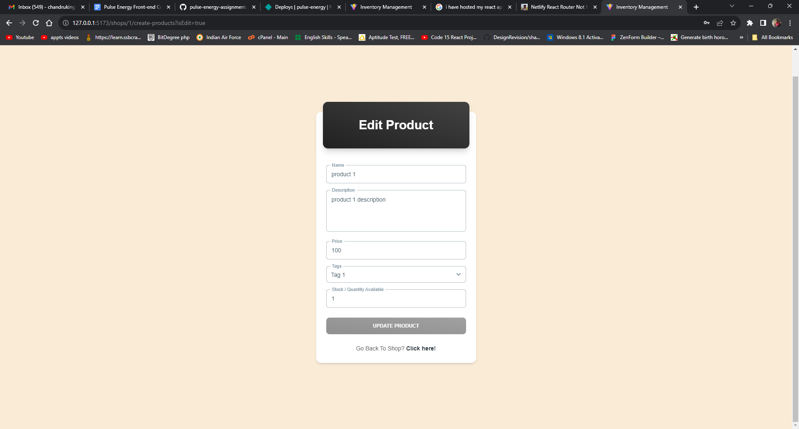
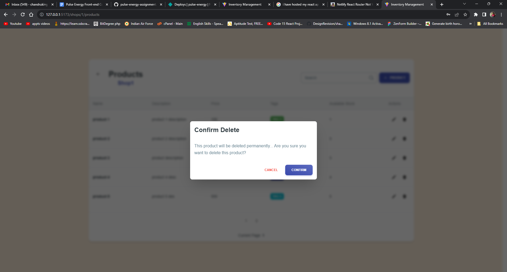

# Inventory Management App - Pulse Energy

Requirement of the app : https://docs.google.com/document/d/1-FNIQ4HUsMFqIK0tKtwICN1M-5kAX5JyD2jOTWEaZP8/edit

## About the app

    This app is build for the interview assignment from the Pulse Energy company. All the requirements can be found in the above link

    Hosted app link: https://pulse-energy.netlify.app

### Tech Stack

1. React Js - Main Library
2. Typescript - Type Support
3. Redux - Global State Management Library
4. Tailwind Css + Material Ui - For Designs
5. Local storage - For storing and retriving the data

### How to run

1. Clone this repository
2. Open terminal, then use `npm install`
3. Then, `npm run dev` to run the app
4. To build: `npm run build`

### Screen Shots:

